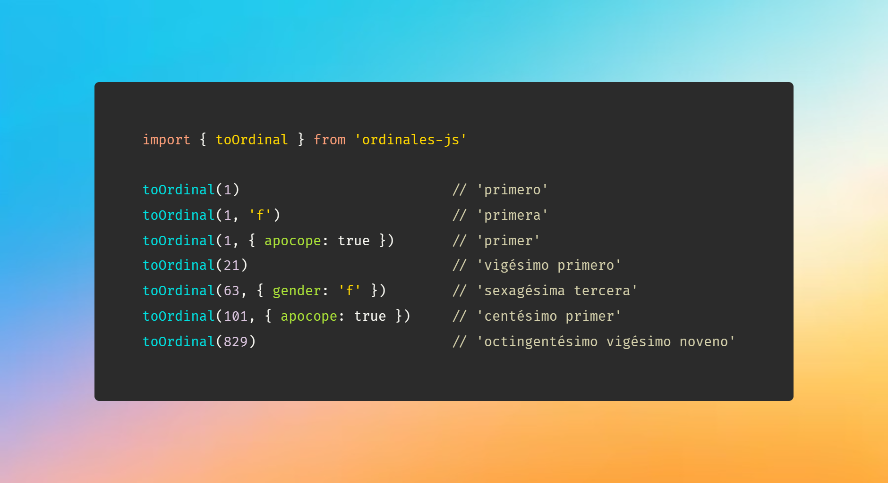

# ordinales-js



---

[](https://github.com/AndresSaa/ordinales-js/actions/workflows/ci.yml)
[](https://www.npmjs.com/package/ordinales-js)
[](./LICENSE)
[](https://npmcharts.com/compare/ordinales-js?minimal=true)
[](https://www.npmjs.com/package/ordinales-js)
[](https://bundlephobia.com/package/ordinales-js)
[](https://www.npmjs.com/package/ordinales-js?activeTab=dependencies)

Librería para convertir números cardinales a ordinales en español.
Soporta género (masculino/femenino), apócope y números hasta millones.

## Requisitos

- Node.js **18** o superior

## Instalación

```bash
npm install ordinales-js
```

## Uso

**ES Modules**

```js
import { toOrdinal } from 'ordinales-js'

toOrdinal(1)                          // 'primero'
toOrdinal(1, 'f')                     // 'primera'
toOrdinal(1, { apocope: true })       // 'primer'
toOrdinal(21)                         // 'vigésimo primero'
toOrdinal(63, { gender: 'f' })        // 'sexagésima tercera'
toOrdinal(101, { apocope: true })     // 'centésimo primer'
toOrdinal(829)                        // 'octingentésimo vigésimo noveno'
```

**CommonJS**

```js
const { toOrdinal } = require('ordinales-js')

toOrdinal(1)                          // 'primero'
toOrdinal(1, 'f')                     // 'primera'
toOrdinal(1, { apocope: true })       // 'primer'
```

## API

### `toOrdinal(numero, opciones?)`

El segundo parámetro acepta un `string` de género o un objeto de opciones.

| Forma | Ejemplo |
|-------|---------|
| `toOrdinal(n)` | género masculino por defecto |
| `toOrdinal(n, 'f')` | género femenino |
| `toOrdinal(n, { gender, apocope })` | objeto de opciones |

#### Opciones

| Opción | Tipo | Por defecto | Descripción |
|--------|------|-------------|-------------|
| `gender` | `'m'` \| `'f'` | `'m'` | Género del ordinal |
| `apocope` | `boolean` | `false` | Aplica apócope (`primero` → `primer`, `tercero` → `tercer`) |

#### Género

```js
// Forma abreviada — string
toOrdinal(1, 'm')             // 'primero'
toOrdinal(1, 'f')             // 'primera'

// Forma objeto
toOrdinal(1,  { gender: 'f' })  // 'primera'
toOrdinal(21, { gender: 'f' })  // 'vigésima primera'
toOrdinal(63, { gender: 'f' })  // 'sexagésima tercera'
```

#### Apócope

Se utiliza cuando el ordinal precede a un sustantivo masculino.

```js
toOrdinal(1,  { apocope: true })             // 'primer'
toOrdinal(3,  { apocope: true })             // 'tercer'
toOrdinal(21, { apocope: true })             // 'vigésimo primer'

// Con género femenino explícito — el apócope no aplica
toOrdinal(1, { gender: 'f', apocope: true }) // 'primera'
```

#### Números grandes

```js
toOrdinal(10000)                        // 'décimo milésimo'
toOrdinal(21000)                        // 'vigésimo primer milésimo'
toOrdinal(21000, 'f')                   // 'vigésima primera milésima'
toOrdinal(123456)                       // 'centésimo vigésimo tercer milésimo cuadrigentésimo quincuagésimo sexto'
toOrdinal(1000000)                      // 'millonésimo'
toOrdinal(2000000)                      // 'dosmillonésimo'
toOrdinal(21000000, { apocope: true })  // 'vigésimo primer millonésimo'
```

### `enhance()`

Extiende el prototipo de `Number` para usar `toOrdinal` directamente sobre cualquier número.

```js
// ESM
import { enhance } from 'ordinales-js'
// CJS
const { enhance } = require('ordinales-js')

enhance()

const numero = 21
numero.toOrdinal()                        // 'vigésimo primero'
numero.toOrdinal('f')                     // 'vigésima primera'
numero.toOrdinal({ gender: 'f' })         // 'vigésima primera'
numero.toOrdinal({ apocope: true })       // 'vigésimo primer'
```

## Demo

```bash
npm run demo
```

## Contribuir

1. Haz un fork del repositorio
2. Crea una rama para tu cambio: `git checkout -b feat/mi-mejora`
3. Realiza tus cambios y añade tests si es necesario
4. Asegúrate de que los tests pasan: `npm test`
5. Abre una Pull Request describiendo el cambio

## Licencia

[MIT](./LICENSE)
